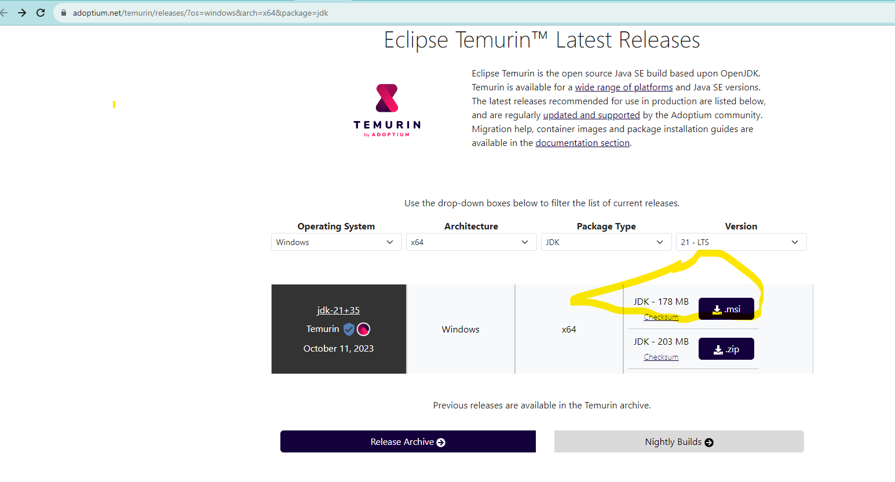

# Perfume website creation (Windows based machine deployment)

## The public folder currently contains :

index.html

style.css

and two perfume photographs that is rendered in index.html.

the local path where the git repo is pointed to is :
C:\Users\souma\OneDrive\Desktop\perfume\code\perfume

## Dependencies :

## 1. Node.js and npm :
      Download Node.js:

      Visit the official Node.js website to download the installer for your Windows system:
      https://nodejs.org/

      Choose the LTS Version:

      On the website, it's recommended to download the LTS (Long Term Support) version, as it's more stable. Click on the "LTS" download button, and the installer will start downloading.

      Install Node.js:

      Run the downloaded installer and follow the installation instructions. The installer will guide you through the process, and it should add Node.js and npm to your system's PATH automatically.

      Verify Installation:

      After the installation is complete, open a new Command Prompt or PowerShell window and run the following commands to verify that Node.js and npm are installed:
       node -v
       npm -v

## 2. Java :
       Download Java Development Kit (JDK):
   
       [website: OpenJDK Downloads.](https://adoptium.net/temurin/releases/)https://adoptium.net/temurin/releases/)
   
        

        Accept the License Agreement:

        On the Oracle website, you'll need to accept the Oracle Technology Network License Agreement. Read and accept the terms to proceed with the download.
        Download the Installer:
        
        
        After accepting the license agreement, the installer file should start downloading automatically. Wait for the download to complete. The file is typically named something like "jdk-xx.x.x_windows-x64_bin.exe" where "xx.x.x" is the version number.
        Run the JDK Installer:
        
        Locate the downloaded installer file, which is usually in your "Downloads" folder or the location where your browser saves downloads.
        
        Double-click the installer file to run it. You may need to confirm administrative privileges to install the software.
        
        Follow the Installation Wizard:
        
        The Java JDK installer will open. Follow the on-screen instructions in the installation wizard. You can typically accept the default settings unless you have specific preferences.
        
        The installer will ask for the installation path. The default path is usually "C:\Program Files\Java\jdk-xx.x.x" where "xx.x.x" is the version number. You can leave this as is or specify a different path if needed.
        
        During the installation, you may see a prompt asking if you want to install the Java Development Kit. Click "Install" to proceed.
        
        Complete the Installation:
        
        Once the installation is complete, you'll see a message indicating that the installation was successful.
        Check the Java Installation:
        
        To verify that Java is installed correctly, open a Command Prompt or PowerShell window and run the following command:

        java -version

## 3. Install and deploy front end on Firebase :

      npm install -g firebase-tools

      npm install firebase

      firebase login

      firebase init

      firebase init hosting

      firebase emulators:start

      locally in your browser check :
      http://127.0.0.1:5000 (UI should be up and running)

      firebase deploy

      

      

   
